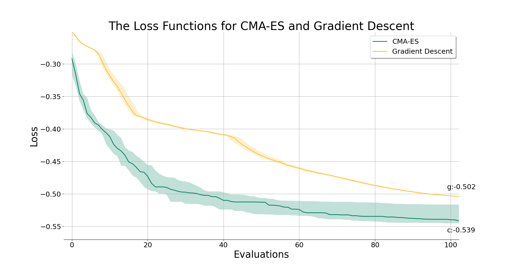
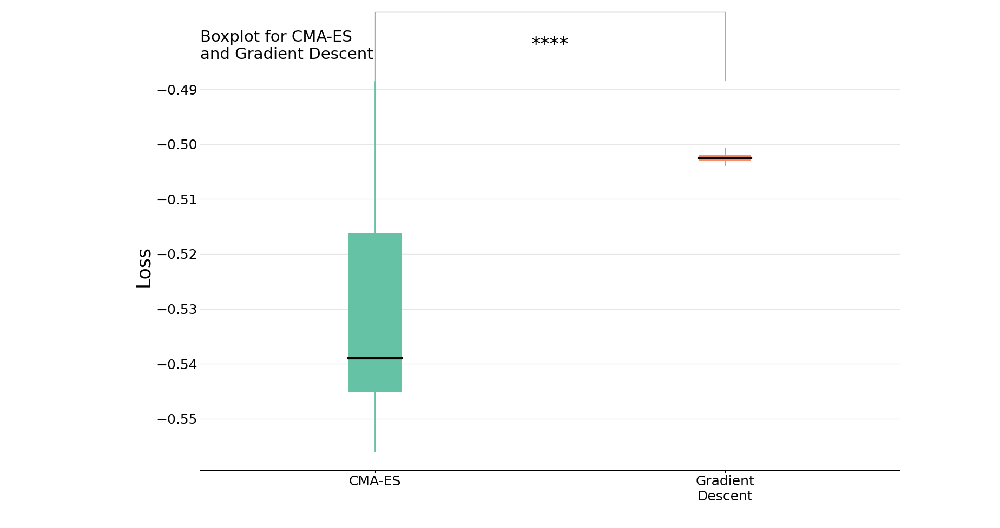

# Projects and Research
****
**Developing a Framework for Soft Robot Simulators**

 Differentiable Programming for Physical Simulation (difftaichi) allows optimization efficiency with brute-force gradient descent. We replaced gradient descent with Covariance Matrix Adaptation Evolutionary Strategy (CMA-ES). CMA-ES was designed to optimize single-objective optimization of continuous spaces. It models the sampling distributions of the population as a multivariate normal distribution N(m, C). Where m is the distribution mean vector and C is the covariance matrix. 

The results of optimizing the loss function with CMA-ES are shown in the video and graphs provided below.

https://github.com/lucyivt/thesis/assets/136722147/c2682a9f-faca-483f-8c1e-1e300a81f9d0

An optimized 2D-biped robot after 1000 evaluations. 

The median loss functions after 100 evaluations for CMA-ES (green) and gradient descent (yellow) along with their 25th and 75th percentile values. The x-axis shows the number of evaluations and the y axis represents the loss values.

The boxplot displays the results of conducting a Mann-Whitney U Test. It shows the median and quartiles at evaluation 100 for CMA-ES and gradient descent. The median value for CMA-ES is -0.539 and for gradient descent, it's -0.502. The p-value was obtained by a two-tailed test and had a value of less than 0.001. The four stars at the top of the boxplot represent the p-value.

****
**8-bit CPU**  

During my Computer Organization course, I utilized logisim to create an 8-bit CPU that supports a variety of MIPS instructions such as R-type, I-type, jump, and BEQ. The instructions support arthmitic, if-statements, and while-loops. 

I also implemented a control logic unit which was necessary to control the selectors attached to the multiplexors. The control logic unit takes in the first 5 bits of the instruction and outputs the type of the current instruction by selecting either 0 or 1 on the multiplexor. The instruction is fetched from the intruction memory.

Instruction and data memory were implemented using RAM components.Logisim has the functionality to take in MIPS assembly code into it's RAM components which is how instructions are fed to the CPU.

In the circuit below the instruction memory is located on the left and data memory is located on the right. The register file and ALU are located in the middle.  

****
**Robotic Autonomous Driving**  

The goal of this project was to make a robot autonomously navigate a roundabout. The type of robot was the Turtlebot3 burger which runs on a raspberry pi that contains ROS. 

The lanes of the roundabout were created by placing green and yellow tape on the floor. Open-source code found on this [github page]((https://github.com/ROBOTIS-GIT/turtlebot3_autorace_2020)) contains code to detect lanes by utilizing openCV. The code was designed only for lanes that don't have any gaps in them. 

However, when the robot enters or exits the roundabout, the yellow lanes have a gap. Whenever the robot would get to the entrance of the roundabout it would get confused and drive off course. 

To counter this issue, a sign was placed at the entrance of the roundabout to notify the robot when to stop detecting lanes and instead when to start rotating in the correct direction. To detect the entrance sign, I developed code utilizing odometry. 

****

**Summer Research**

As an embryo grows, we aim to better visualize and understand the internal mechanical components. Early stages of embryonic development were simulated in a software called ABAQUS. A cylindrical model with a tetrahedral mesh was created to represent the embryo. Finite element analysis (FEA) was utilized to help analyze the changes in mechanical components such as strain, stress, and deformation. 

To analyze these changes, a region of nodes called a path on the mesh of the model gets selected and the values at those points get plotted on a graph. Since the software ABAQUS doesn't always create an efficient path, our goal was to develop an algorithm that will always find the shortest path between two nodes. 

Not only did the tetrahedrons to vary in size, but also a quadratic geometric order was applied to the mesh. This was done  to better represent the complex geometry and bending deformations and increased the number of nodes on each tetrahedron. Therefore the algorithm needed to account for different weighted edges.

That being the case, an algorithm using informed search and non-uniform cost was used to find a solution. By extending Dijkstra’s algorithm with a heuristic estimate h(n), the A* search algorithm was used to find the shortest path between two arbitrary nodes. An adjacency matrix represented the node connectivity in the model (dimensions were 9377 x 9377). 
By specifying two arbitrary nodes, the algorithm successfully generated a path. The calculated path is marginally different than the path created by ABAQUS. Especially near the end of the path where the calculated path has a staircase-like formation.  Overall, the calculated path contains more nodes and appears less smooth. 

